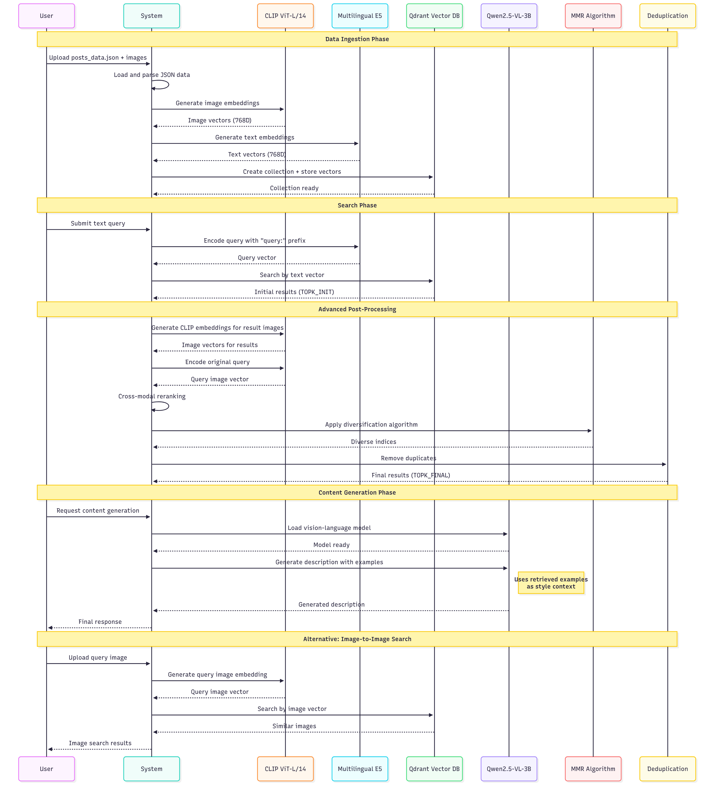

# MultimodalRAG-CLIP-Qdrant-ContextEngineering

This demonstrates a complete multimodal RAG (Retrieval-Augmented Generation) system that combines:

- **Image and Text Embeddings**: Using CLIP for images and multilingual E5 for text
- **Vector Database**: Qdrant for efficient similarity search
- **Content Generation**: Qwen2.5-VL for generating descriptions from retrieved examples
- **Advanced Retrieval**: MMR (Maximal Marginal Relevance) and deduplication

## Features
- Multi-modal search (text-to-image, image-to-image)
- Cross-modal reranking using CLIP
- MMR diversification to avoid redundant results
- Content generation inspired by retrieved examples
- Support for multilingual text (including Bangla)

